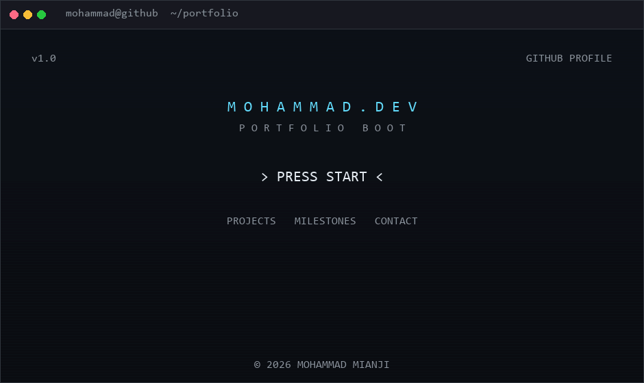

<p align="center">
  
</p>

<p align="center">
  <em>Frontend Developer • React Ecosystem • Continuous Learning</em>
</p>

---

### Frontend Developer focused on the React ecosystem

Currently building modern web applications while continuously improving my software engineering skills.


---

## 🧭 About Me

My programming journey started years ago, but life took me through several different paths before bringing me back to development.

Now I'm rebuilding everything from the ground up with one clear goal:

🎯 **Becoming a professional Frontend Developer.**

I enjoy building software the same way I enjoy great games:
with attention to detail, meaningful user experience, and long-term maintainability.

---

## Featured Work

### 🤝 Freelancing Platform · _in active development_

A role-based marketplace with distinct client, freelancer, and admin experiences: authentication,
protected routes, server-state caching, and multi-step forms with validation. My largest project so
far, and the one where I stopped optimising for "it works" and started optimising for "someone else
could maintain this."

**React · React Query · React Hook Form · Tailwind CSS · REST API**

[](https://github.com/Mohammad-Mianji/freelancing-platform)
_Live demo coming soon_

### 🏨 Hotel Booking App

A booking flow built around keeping interactive map navigation, location search, and date selection
in sync — so a search result stays coherent as the user moves between them.

**React · Context API · REST API · Tailwind CSS**

[](https://github.com/Mohammad-Mianji/hotel-booking-app)

### 🛸 Rick and Morty Explorer

A character browser built to get REST API consumption right end to end: fetching, search, and every
async state handled explicitly rather than assumed away.

**React · Custom Hooks · REST API**

[](https://github.com/Mohammad-Mianji/Rick-and-Morty-App)

---

## 🛠 Tech Stack

**Frontend**


-F7DF1E?style=for-the-badge&logo=javascript&logoColor=black>)


**Data Fetching & Forms**


**State Management**


**Tools**


---

## 🐦 Current Mission

Rebuilding my professional developer profile from scratch.

**Main Quests:**

- [ ] Responsive Design & CSS Deep Dive

**Next Quests:**

- [ ] TypeScript
- [ ] React Testing
- [ ] React Optimization
- [ ] Next.js

---

## 🟢🔵🟣 Developer Journey

**🟢 Learning** — projects that helped me understand core concepts

- [Accordion App](https://github.com/Mohammad-Mianji/accordion-practice)
- [Notes App](https://github.com/Mohammad-Mianji/Note-App)
- [Notes App with RTK](https://github.com/Mohammad-Mianji/react-redux-toolkit-todo)

**🔵 Portfolio** — projects built to simulate real-world applications

- 🛸 [Rick and Morty App](https://github.com/Mohammad-Mianji/Rick-and-Morty-App)

- 🏨 [Hotel Booking App](https://github.com/Mohammad-Mianji/hotel-booking-app)

**🟣 Showcase**

- 🐦 [Freelancing Platform](https://github.com/Mohammad-Mianji/freelancing-platform/)

---

## 🧠 What I value

I care more about software quality than writing code quickly.

Things I always try to improve:

- Clean Architecture
- Maintainability
- User Experience
- Long-term Thinking
- Continuous Learning

---

## 📜 Development Philosophy

Every project teaches me something I carry into the next one.

I believe growth happens through iteration, refactoring, and curiosity.

---

## 🤝 Let's Connect

Looking for a Frontend Developer?

Let's build something meaningful.

[](https://www.linkedin.com/in/mohammad-salkhorde-dev/)
[](https://t.me/Mohammad_Mianji)
[](mailto:mianji021@yahoo.com)

---

## 🏅 Milestones

Instead of certificates, I prefer shipping projects. Here's what each one unlocked:

| Milestone                                             | Where                                                                            |
| ----------------------------------------------------- | -------------------------------------------------------------------------------- |
| 🏅 First REST API integration                         | [Rick and Morty Explorer](https://github.com/Mohammad-Mianji/Rick-and-Morty-App) |
| 🏅 First custom hook                                  | [Rick and Morty Explorer](https://github.com/Mohammad-Mianji/Rick-and-Morty-App) |
| 🏅 First Context API + useReducer state               | [Hotel Booking App](https://github.com/Mohammad-Mianji/hotel-booking-app)        |
| 🏅 First React Query integration                      | Freelancing Platform                                                             |
| 🏅 First reusable form architecture (React Hook Form) | Freelancing Platform                                                             |
| 🏅 First authentication & protected routes            | Freelancing Platform                                                             |

---

## 🌌 Final Screen

```text
Every repository here
represents a step
I chose not to skip.
```

```
▶ Continue Journey
```
