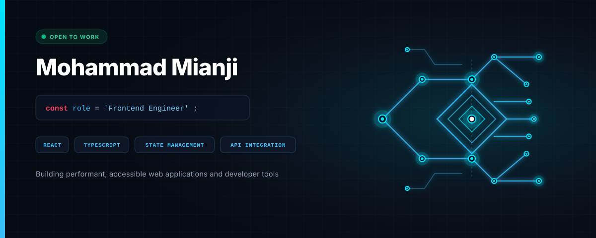
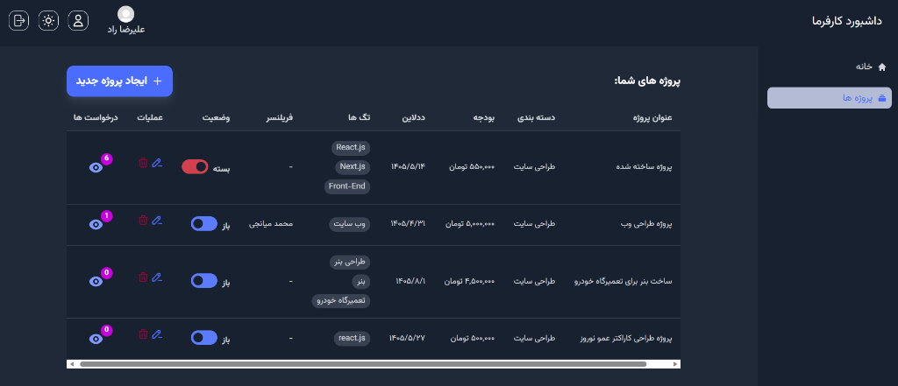
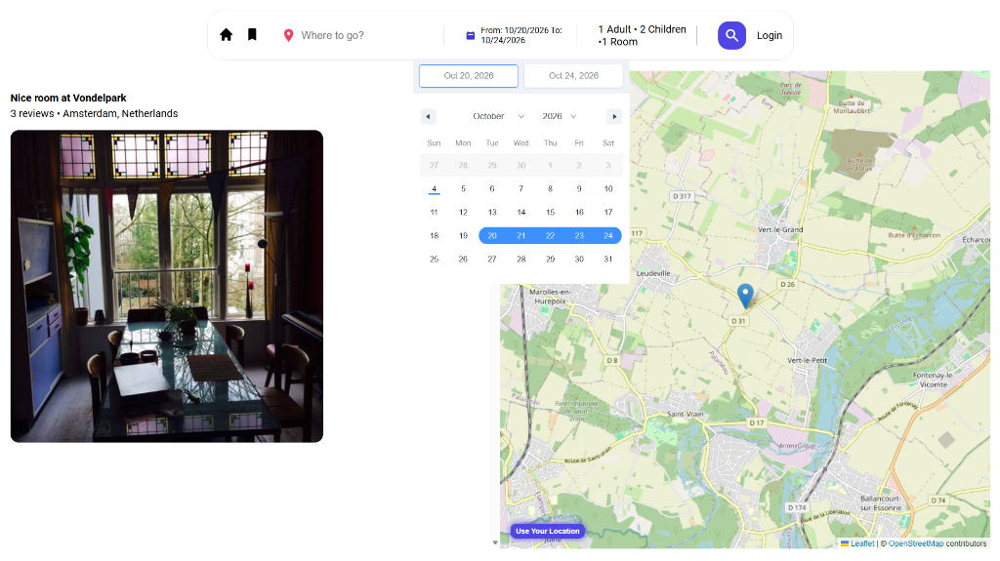

  

  <em>Frontend Developer • React • TypeScript</em>

---

### Frontend Developer

Building modern, responsive web applications with a focus on clean architecture and maintainable code.

---

## 🧭 About Me

I'm a Frontend Developer specializing in the React ecosystem and TypeScript.

I enjoy building software the same way I enjoy great games: with attention to detail, meaningful user experience, and a focus on long-term maintainability. Whether it's handling complex state, integrating REST APIs, or creating responsive UIs, my goal is to write code that works seamlessly for the user and remains predictable for the next developer who reads it.

---

## Featured Work

### 🤝 Freelancing Platform · _in active development_

  

A role-based marketplace with distinct client, freelancer, and admin experiences: authentication,
protected routes, server-state caching, and multi-step forms with validation. My largest project so
far, and the one where I stopped optimising for "it works" and started optimising for "someone else
could maintain this."

**React · React Query · React Hook Form · Tailwind CSS · REST API**

_Live demo coming soon_

### 🏨 Hotel Booking App

  

A booking flow built around keeping interactive map navigation, location search, and date selection
in sync — so a search result stays coherent as the user moves between them.

**React · Tailwind CSS · REST API**

---

## 🛠 Tech Stack

**Languages & Frameworks**

-F7DF1E?style=for-the-badge&logo=javascript&logoColor=black>)

**Styling & UI**

**State Management & Data Fetching**

**Ecosystem & Tools**

---

## 🧠 What I Value

I care deeply about software quality, not just shipping quickly. I believe growth happens through iteration, refactoring, and curiosity.

Things I always try to prioritize:

- Clean Architecture
- Maintainability
- User Experience
- Long-term Thinking

---

## 🤝 Let's Connect

Looking for a Frontend Developer? Let's build something meaningful.

